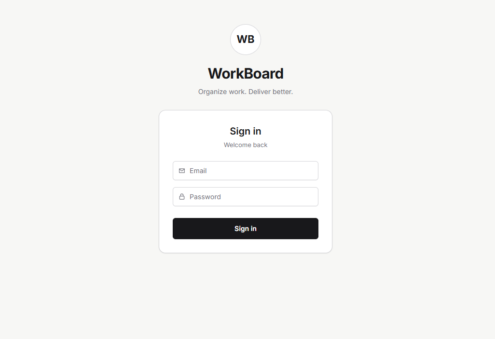
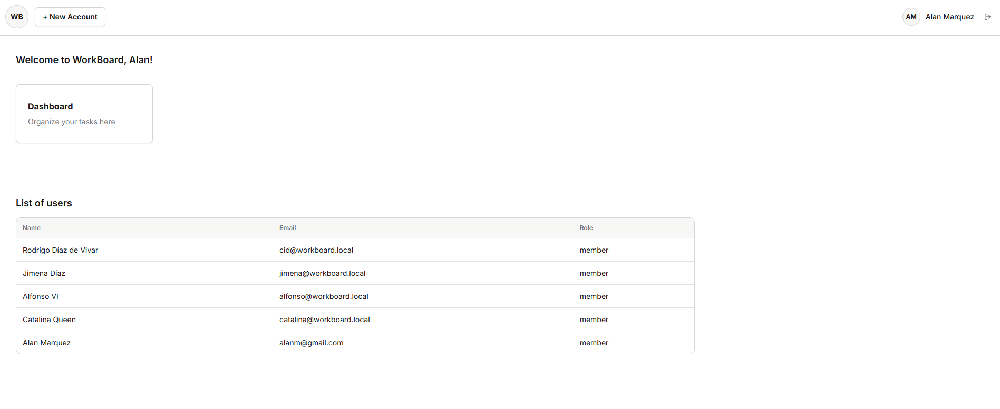
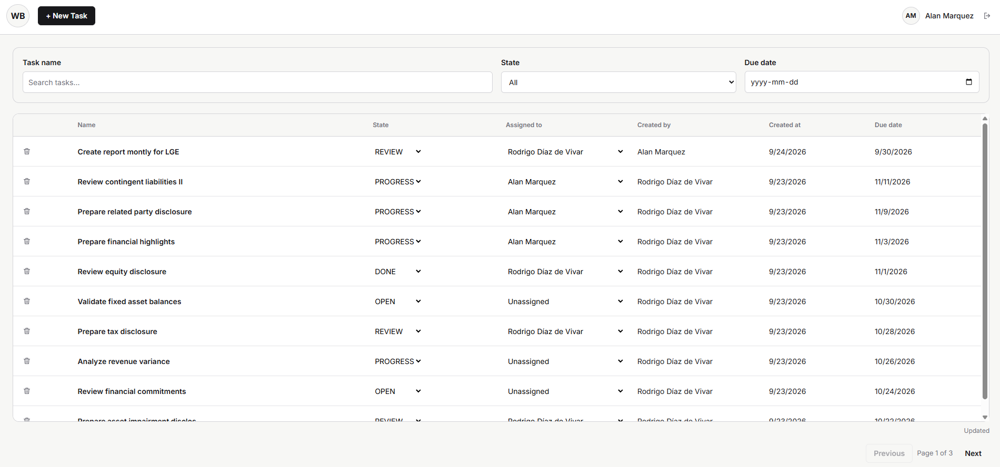
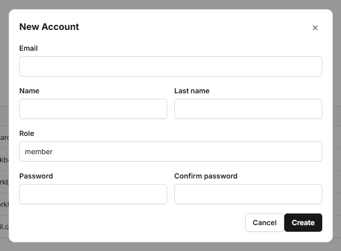
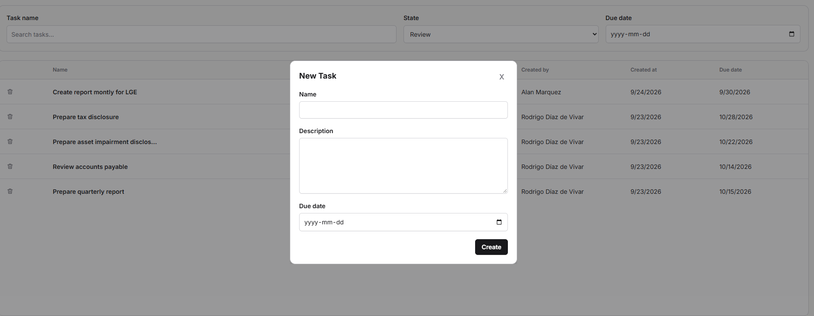

# WorkBoard

## Description

WorkBoard is a task management application with a Django REST API backend and a React frontend. The backend is responsible for authentication, account management, task persistence, business rules, background processing, and OpenAPI documentation. The frontend provides the user interface for login, home navigation, account creation, task listing, task creation, assignment, state changes, and task editing.

### Quick Start

Start the complete application with Docker Compose:

```bash
docker compose up --build
```

Then open:

```text
http://127.0.0.1:8080
```

The frontend is exposed on local port `8080`. The Django backend runs inside Docker and is reached by the frontend through the `/api/` Nginx proxy.

## Login Credentials

```text
Email: cid@workboard.local
Password: Cid123!
```

## Technologies Used

| Area | Technologies |
| --- | --- |
| Backend | Python 3.13, Django, Django REST Framework, Simple JWT |
| Frontend | React, TypeScript, Vite, React Router DOM |
| Database | SQLite |
| Workers / Background Processing | django-tasks-db, Django `db_worker` |
| Testing | pytest, pytest-django, pytest-cov, Ruff |
| Frontend State and Forms | TanStack Query, React Hook Form, Zod |
| Infrastructure / Containers | Docker, Docker Compose, Nginx, Gunicorn |
| API Documentation | drf-spectacular, Swagger UI, OpenAPI schema |

## Backend Architecture

The backend is a Django project located in [`backend/`](./backend). Source code lives under [`backend/src/`](./backend/src) and is organized by business module.

The main Django project is [`config`](./backend/src/config), which owns settings, URL routing, WSGI/ASGI configuration, and the global exception handler. Application code is grouped under [`apps`](./backend/src/apps):

- `accounts`: authentication, account registration, user lookup, user listing, JWT token generation, and account repository logic.
- `taskmanager`: task creation, filtering, update, deletion, assignment, state changes, task states, and background task creation.

Each backend module follows the same general shape:

- `api`: DRF viewsets, serializers, URL routes, and module exception mapping.
- `application`: services, selectors, DTOs, and interfaces for use cases.
- `infrastructure`: repository implementations that talk to Django models.
- `models.py`: database models and persistence definitions.
- `exceptions.py`: business-specific exceptions.

```text
Client
  |
  v
DRF API layer
  |
  v
Serializers -> DTOs
  |
  v
Services / Selectors
  |
  v
Repository interfaces
  |
  v
Django repository implementations
  |
  v
SQLite database
```

Authentication uses JWT through `djangorestframework-simplejwt`. Public endpoints such as login return access and refresh tokens. Protected endpoints use DRF authentication and permission classes.

Task creation can enqueue work through `django-tasks-db`. The `db_worker` process reads queued jobs from the database and executes them, so the API and background processing remain separated while sharing the same database.

## Frontend Architecture

The frontend is a Vite React application located in [`frontend/`](./frontend). Source code lives under [`frontend/src/`](./frontend/src).

Important areas:

- `pages`: route-level screens such as login, home, and task dashboard.
- `components`: reusable UI pieces such as modal provider, toast provider, new account modal, new task modal, and task detail modal.
- `api`: Axios HTTP clients and endpoint functions. Pages and components do not call this layer directly.
- `hooks`: feature hooks that are the only layer allowed to communicate with API modules.
- `providers/auth`: authentication context and provider.
- `routes`: React Router route declarations and protected route handling.
- `app.types.ts`: shared application and API types.

The frontend uses React Router DOM for navigation. `/login` is public, while `/home` and `/taskdashboard` are protected by `ProtectedRoute`. The auth provider stores JWT tokens, configures the Axios authorization header, and exposes `login` and `logout` through `useAuth`.

TanStack Query is used by data hooks for server state, caching, mutations, and query invalidation. React Hook Form and Zod are used for form state and validation in forms such as login, account creation, task creation, and task editing.

## Running Django

Run the backend manually from the repository root:

```bash
cd backend
uv sync
```

Apply migrations:

```bash
uv run python manage.py migrate
```

Start the Django development server:

```bash
uv run python manage.py runserver
```

The backend will be available at:

```text
http://127.0.0.1:8000
```

## Running the DB Worker

The DB worker processes background jobs stored by `django-tasks-db`, such as queued task creation work. Run it in a separate terminal while the backend is running:

```bash
cd backend
uv sync
uv run python manage.py db_worker
```

## Running Tests

Run the backend test suite:

```bash
cd backend
uv run pytest
```

Run only account tests:

```bash
cd backend
uv run pytest src/apps/accounts/tests
```

## Running Tests with Coverage

Run backend tests with coverage:

```bash
cd backend
uv run pytest --cov=src/apps --cov-report=term-missing --cov-report=html
```

Coverage output is printed in the terminal. The HTML report is generated at:

```text
backend/htmlcov/index.html
```

## Running the React Frontend

Install dependencies:

```bash
cd frontend
npm ci
```

Start the development server:

```bash
npm run dev
```

By default, the frontend API client points to:

```text
http://127.0.0.1:8000/api
```

## Swagger / API Documentation

When running the backend manually:

```text
Swagger UI: http://127.0.0.1:8000/api/docs/
OpenAPI Schema: http://127.0.0.1:8000/api/schema/
```

When running through Docker Compose:

```text
Swagger UI: http://127.0.0.1:8080/api/docs/
OpenAPI Schema: http://127.0.0.1:8080/api/schema/
```

## Postman Collection

A Postman collection is available in the project root:

[Postman Collection](./WorkBoad.postman_collection.json)

Import it into Postman to test the API endpoints directly.

## Screenshots










